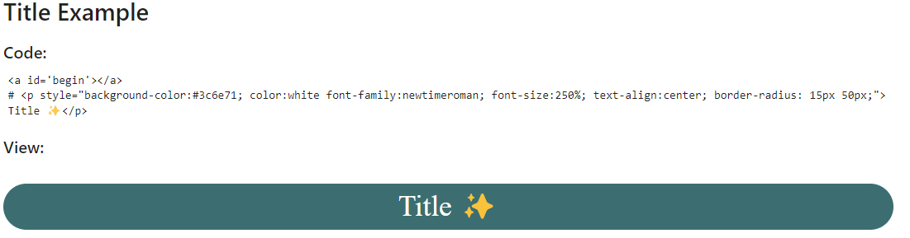

# Template headers for Notebooks (Markdown)

Some times you want to include a header in your notebooks. This is a good way to do it.

Example:

You can use the code or view all the suggested headers in the [template headers](https://github.com/GilbertoNavaMarcos/template-notebooks/blob/main/template%20headers.ipynb)

Dont worry about size, it will be automatically resized. because is a markdown